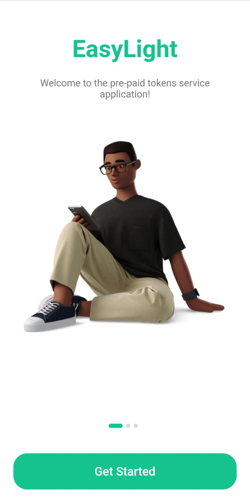
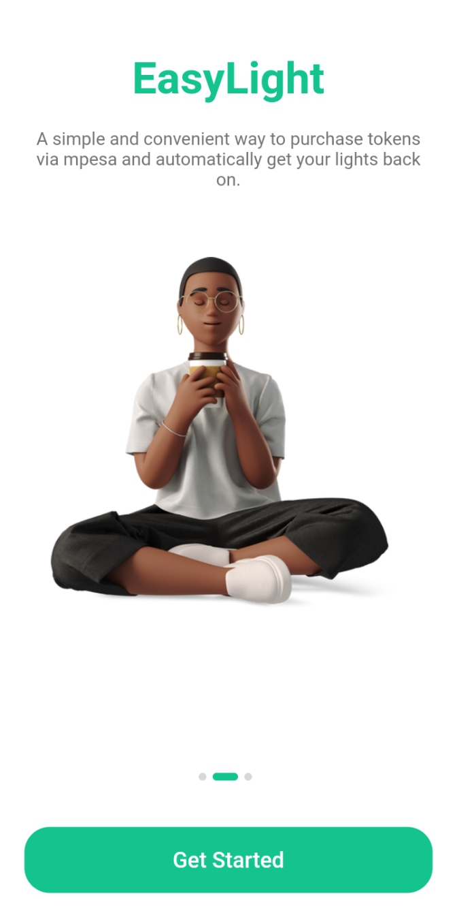
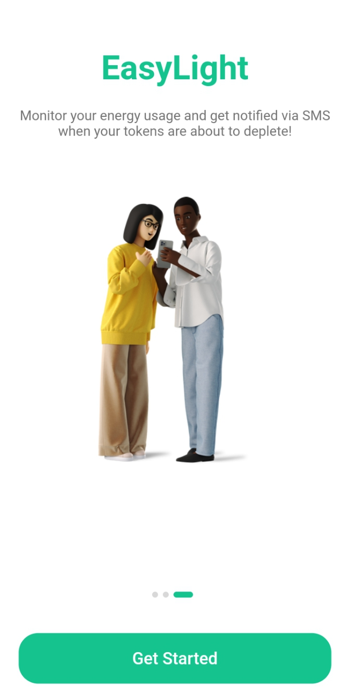
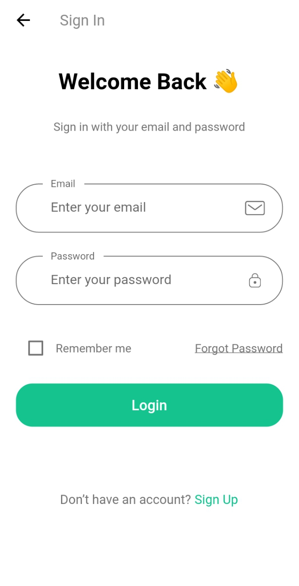
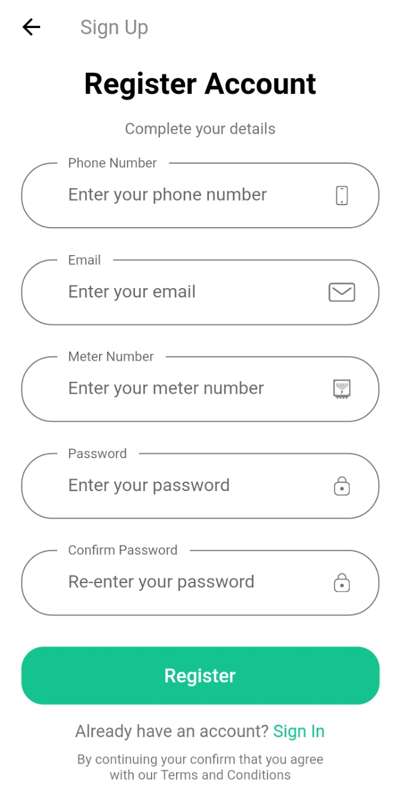
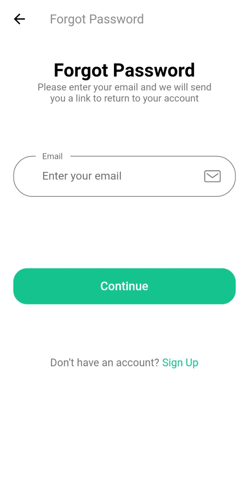
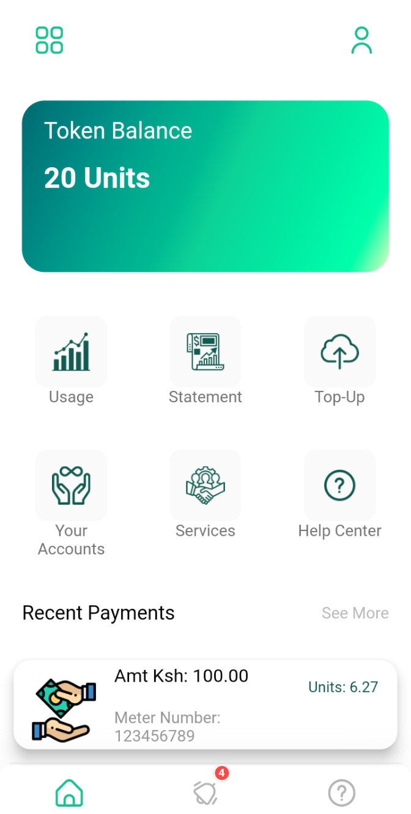

# EASY LIGHT
Easy light application is designed to provide users with a more convenient and user-friendly way to monitor and control their lights.
The application allows users to purchase prepaid tokens and get notified via SMS notifications when the tokens are about to deplete.

### Features
- Purchase prepaid tokens
- Monitor usage of prepaid tokens
- Get notified via SMS when the tokens are about to deplete

### Sample Images

 

 
